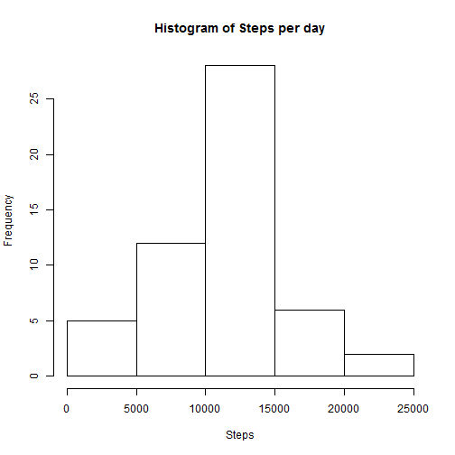
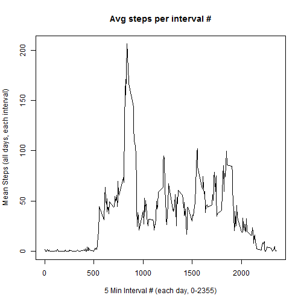
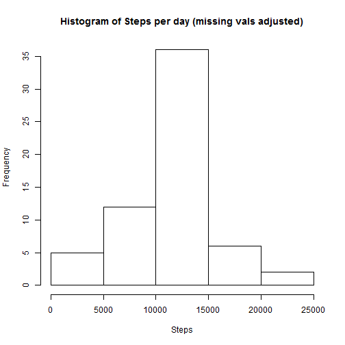
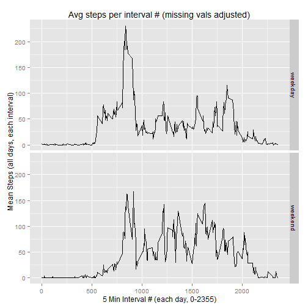

Read in the csv file.

```r
rawData <- read.csv("activity.csv", header=TRUE, colClasses=c("integer", "Date", "integer"))
```

Calculate the total number of steps per day (ignore NA's).

```r
library(dplyr)
stepsPerDay <- rawData %>% group_by(date) %>% 
    summarize(sumSteps = sum(steps))
stepsPerDay
```

```
## Source: local data frame [61 x 2]
## 
##          date sumSteps
## 1  2012-10-01       NA
## 2  2012-10-02      126
## 3  2012-10-03    11352
## 4  2012-10-04    12116
## 5  2012-10-05    13294
## 6  2012-10-06    15420
## 7  2012-10-07    11015
## 8  2012-10-08       NA
## 9  2012-10-09    12811
## 10 2012-10-10     9900
## ..        ...      ...
```

Create histogram of total steps per day.

```r
hist(stepsPerDay$sumSteps, xlab="Steps",
     main="Histogram of Steps per day")
```

 

Calc mean and median steps per day.

```r
summarize(stepsPerDay, meanSteps=mean(sumSteps, na.rm=TRUE), medianSteps=median(sumSteps, na.rm=TRUE))
```

```
## Source: local data frame [1 x 2]
## 
##   meanSteps medianSteps
## 1  10766.19       10765
```
Plot the 5 min. intervals of each day (x-axis) -- 0 to 2355. Average each corresponding interval's steps for all the sample dates and plot.

```r
meanStepsInter <- group_by(rawData, interval) %>%
summarize(msi = mean(steps, na.rm=TRUE))

plot(x=meanStepsInter$interval, y=meanStepsInter$msi, 
     type="l", xlab="5 Min Interval # (each day, 0-2355)", ylab="Mean Steps (all days, each interval)",
main="Avg steps per interval #")
```

 

Interval (across all days) w/max steps.

```r
subset(meanStepsInter, msi==max(msi), select=c("interval") )
```

```
## Source: local data frame [1 x 1]
## 
##   interval
## 1      835
```

Count the number of rows w/missing values

```r
count(rawData[!complete.cases(rawData),])
```

```
## Source: local data frame [1 x 1]
## 
##      n
## 1 2304
```
Replace any missing vals w/the mean steps for that interval #. (Adjusted dataset is adjRawData). Example of five rows of adj data set w/filled in missing values shown.

```r
adjRawData <- rawData
rm(rawData)
sumTbl <- group_by(adjRawData, interval) %>% summarize    (mnint = mean(steps, na.rm=TRUE)) 
adjRawData <- merge(adjRawData, sumTbl, by="interval")
adjRawData <- arrange(adjRawData, date, interval)
for (x in which(is.na(adjRawData$steps))) 
    {adjRawData$steps[x] = adjRawData$mnint[x]}
adjRawData [1:5,]
```

```
##   interval     steps       date     mnint
## 1        0 1.7169811 2012-10-01 1.7169811
## 2        5 0.3396226 2012-10-01 0.3396226
## 3       10 0.1320755 2012-10-01 0.1320755
## 4       15 0.1509434 2012-10-01 0.1509434
## 5       20 0.0754717 2012-10-01 0.0754717
```

Using adjusted dataset (missing vals filled in), calculate the total number of steps per day.

```r
adjStepsPerDay <- adjRawData %>% group_by(date) %>% 
    summarize(adjSumSteps = sum(steps))
adjStepsPerDay
```

```
## Source: local data frame [61 x 2]
## 
##          date adjSumSteps
## 1  2012-10-01    10766.19
## 2  2012-10-02      126.00
## 3  2012-10-03    11352.00
## 4  2012-10-04    12116.00
## 5  2012-10-05    13294.00
## 6  2012-10-06    15420.00
## 7  2012-10-07    11015.00
## 8  2012-10-08    10766.19
## 9  2012-10-09    12811.00
## 10 2012-10-10     9900.00
## ..        ...         ...
```

Using adjusted dataset (missing vals filled in), create histogram of total steps per day.

```r
hist(adjStepsPerDay$adjSumSteps, xlab="Steps",
     main="Histogram of Steps per day (missing vals adjusted)")
```

 

Using adjusted dataset (missing vals filled in), calculate mean and median steps per day.

```r
summarize(adjStepsPerDay, adjMeanSteps=mean(adjSumSteps), adjMedianSteps=median(adjSumSteps))
```

```
## Source: local data frame [1 x 2]
## 
##   adjMeanSteps adjMedianSteps
## 1     10766.19       10766.19
```


**Answers to Question 4 on Imputing Missing Values**   
- The original and adjusted dataset means are the same. The original median has increased by 1.19 steps to equal the mean.  
- Re the original and adjusted distributions of total steps per day: they are similar, however, the 10K-15K bucket in the center is taller for the adjusted dataset.  
- Re the total number of steps per day, adjusted vs. original: since the original dataset had 8 days w/all missing data and the rest w/data, only those 8 days now have data filled in and the interval numbers for those days can be summed (in the adjusted data set, each missing interval\'s steps value is filled in w/the mean of that interval number\'s steps across all days).

Add factor var indicating weekend/weekday.

```r
adjRawData <- mutate(adjRawData, daytype = ifelse (weekdays(date) %in% c('Saturday','Sunday'), "weekend", "weekday"))
adjRawData$daytype = factor(adjRawData$daytype)
```
Plot the 5 min. intervals of each day (x-axis) -- 0 to 2355. Average each corresponding interval's steps for all the sample dates and plot. Categorize by weekday/weekday.

```r
adjMeanStepsInter <- group_by(adjRawData, interval, daytype) %>%
summarize(adjMsi = mean(steps))
library(ggplot2)
print(qplot(interval, adjMsi,
        data=adjMeanStepsInter,
        ylab="Mean Steps (all days, each interval)",
        xlab="5 Min Interval # (each day, 0-2355)",
        geom=c("line"), facets=daytype~.,
        main="Avg steps per interval # (missing vals adjusted)"))
```

 
